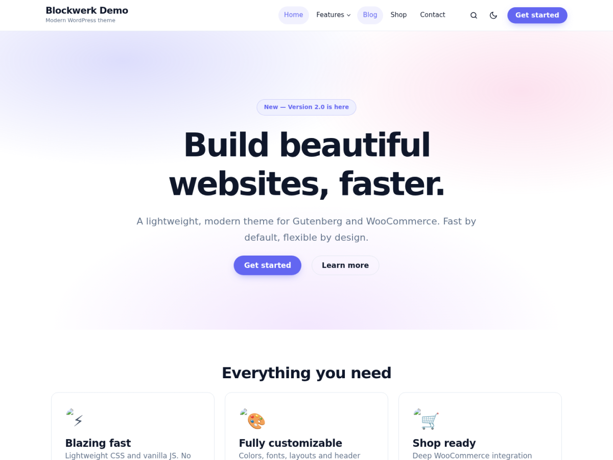

# Blockwerk – modernes WordPress-Theme (Gutenberg + WooCommerce)

Ein eigenes, schlankes Theme mit dem Funktionsumfang von Blocksy – aber mit
modernem Design: Glas-Header, Verläufe, runde Karten, Dark Mode, flüssige
Typografie. Kein jQuery, keine Abhängigkeiten, GPL-2.0.



## Installation

1. `blockwerk.zip` herunterladen (liegt in diesem Ordner)
   – oder selbst packen: `cd wordpress-theme && zip -r blockwerk.zip blockwerk`
2. WordPress → **Design → Themes → Theme hinzufügen → Theme hochladen**
3. ZIP auswählen, installieren, **aktivieren**
4. Einstellungen unter **Design → Customizer → Blockwerk Options**

Voraussetzungen: WordPress 6.3+, PHP 7.4+. WooCommerce optional.

## Funktionen

| Bereich | Funktionen |
|---|---|
| **Layout** | Volle Breite oder „Boxed“, Container- und Inhaltsbreite, Eckenradius, Sidebar links/rechts/keine (getrennt für Beiträge, Seiten, Shop) |
| **Header** | 3 Layouts (Logo links · Logo zentriert · Split), Sticky-Header mit Glas-Effekt, transparenter Header auf der Startseite, Topbar mit Text/Menü/Social, Suche als Overlay (Taste `/`), Button, Mehrstufige Dropdown-Menüs |
| **Mobil** | Off-Canvas-Menü mit Suche und Social Icons, Esc zum Schließen |
| **Farben** | 7 Farbregler (Akzent, Text, Überschriften, Hintergrund, Header, Footer), Dark-Mode-Schalter, Standard hell/dunkel/System |
| **Typografie** | Schriften für Text und Überschriften (Inter, Manrope, Poppins, Space Grotesk, Lora, Roboto, System, Serif), Basisgröße |
| **Blog** | Grid / Liste / Klassisch, 2–4 Spalten, Auszugslänge, Kategorie-Badges, Lesezeit, Lesefortschrittsbalken, Teilen-Buttons + Link kopieren, Autorbox, ähnliche Beiträge, Vor/Zurück-Navigation |
| **Allgemein** | Breadcrumbs (mit Schema.org, nutzt Yoast/Rank Math falls aktiv), „Nach oben“-Button, 404-Seite, Kommentare |
| **Footer** | 0–4 Widget-Spalten, Copyright mit `{year}` / `{site}`, Footer-Menü, Social Icons |
| **Gutenberg** | `theme.json` mit Farbpalette, Verläufen, flüssigen Schriftgrößen, Abständen, Schatten; Block-Patterns (Hero, Feature-Karten, CTA); Block-Stile (Karte, Glas, Bild mit Schatten, Verlaufstext); Editor-Styles |
| **WooCommerce** | Produkte pro Reihe/Seite, Shop-Sidebar, Warenkorb-Icon mit Live-Zähler (AJAX), Konto-Icon, Rabatt-Badge in %, zweites Bild beim Hover, gestylter Warenkorb/Checkout/Mein Konto, Galerie mit Zoom/Lightbox/Slider |

## Dateien

```
blockwerk/
├── style.css            Theme-Header + gesamtes Design (CSS-Variablen)
├── theme.json           Gutenberg-Einstellungen
├── functions.php        Setup, Menüs, Widgets, Assets
├── header.php / footer.php / index.php / single.php / page.php / 404.php …
├── template-parts/      Beitrags-Karten, Einzelbeitrag, „nichts gefunden“
├── inc/
│   ├── customizer.php   alle Optionen
│   ├── dynamic-css.php  Customizer → CSS-Variablen, Google Fonts
│   ├── template-tags.php Breadcrumbs, Icons, Lesezeit, Teilen, Autorbox …
│   ├── block-patterns.php
│   └── woocommerce.php
└── assets/  js/main.js · css/woocommerce.css · css/editor.css
```

## Hinweis Datenschutz (DSGVO)

Die Schriften (außer „System UI“ und „Classic serif“) werden von Google Fonts
geladen. Wer das vermeiden will, wählt im Customizer **System UI** – oder hostet
die Schrift lokal und entfernt sie per Filter:

```php
add_filter( 'blockwerk_google_fonts', '__return_empty_array' );
```

## Anpassen per Code

- `blockwerk_sidebar_position` – Sidebar-Position überschreiben
- `blockwerk_dynamic_css` – eigenes CSS anhängen
- `blockwerk_header_actions` (Action) – eigene Icons/Buttons im Header
